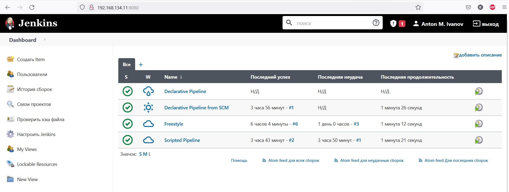
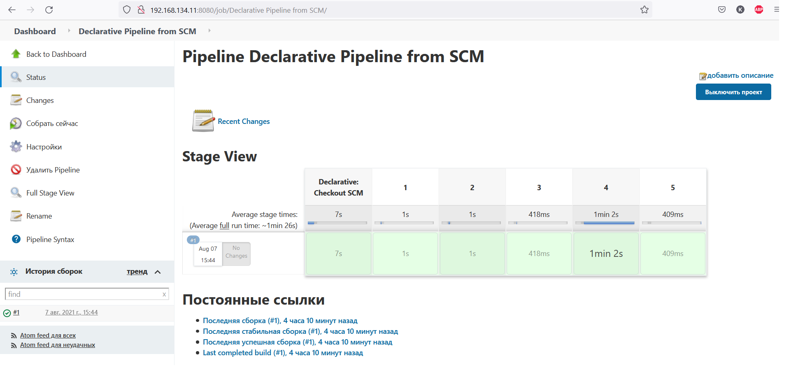
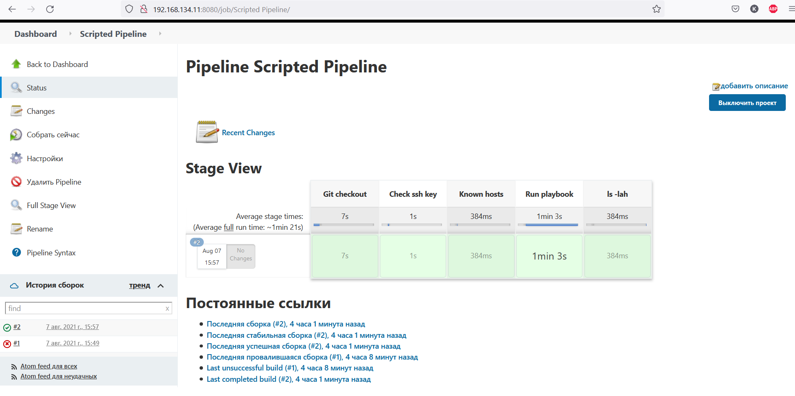

# Домашнее задание к занятию "09.03 Jenkins"

Jenkins установил на локальную машину, агенты динамические, запускаются в контейнерах Docker

[Jenkinsfile](Jenkinsfile) для  Declarative Pipeline

[ScriptedJenkinsfile](ScriptedJenkinsfile) для Scripted Pipeline

Сриншот моего Dashboard:
​

Сриншот выполнения декларативного Pipeline из моего репозитория:
​

Скриншот выполнения Scripted Pipeline:
​