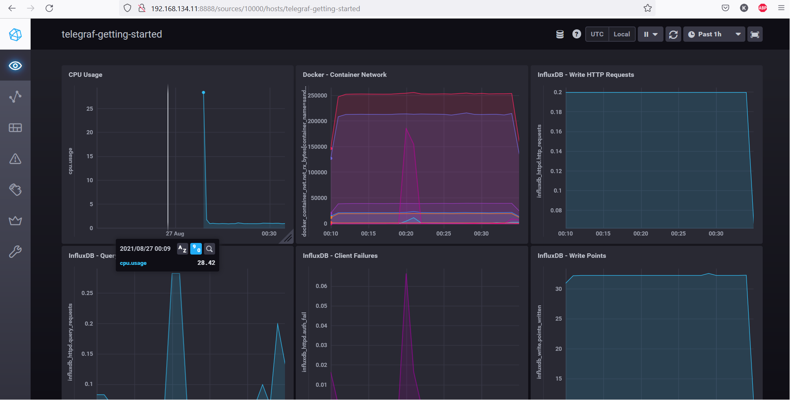
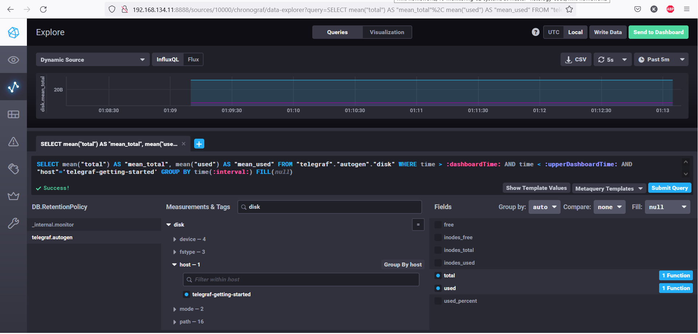
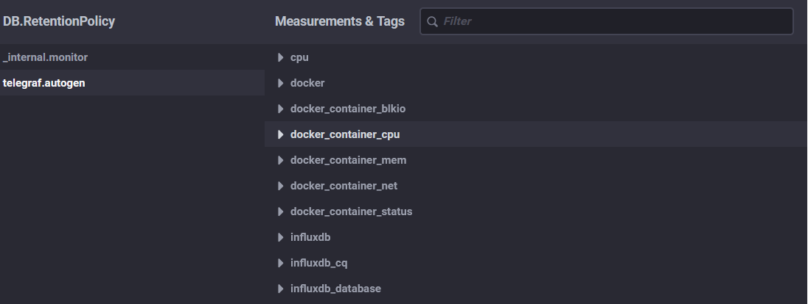

# Домашнее задание к занятию "10.02. Системы мониторинга"

## 1. Опишите основные плюсы и минусы pull и push систем мониторинга.

## Преимущества pull

- проще контролировать подлинность и объем данных
- проще зашифровать трафик
- возможность получать данные по запросу. В модели push наши руки как бы связаны, если мы не получаем никаких показателей, это означает одно из двух: либо проблемы с сетью, либо проблемы с клиентом.

## Преимущества push

- проще реализовать репликацию в разные точки приема. Можно просто передавать траффик более чем на один целевой IP-адрес
- модель push является более производительной, обычно используется протокол UDP, тогда как модель pull основана на TCP (HTTP)

## 2. Какие из ниже перечисленных систем относятся к push модели, а какие к pull? А может есть гибридные?
### Push:

- TICK
- Graphite

### Pull:

- Prometheus 
- Nagios
- Zabbix (по умолчанию pull, но может и push)
- VictoriaMetrics (по умолчанию pull, но может и push)


## 3. Запустите TICK-стэк, используя технологии docker и docker-compose.

kosmos@centos8:~$ curl -v http://localhost:8086/ping
```
*   Trying ::1...
* TCP_NODELAY set
* Connected to localhost (::1) port 8086 (#0)
> GET /ping HTTP/1.1
> Host: localhost:8086
> User-Agent: curl/7.61.1
> Accept: */*
>
< HTTP/1.1 204 No Content
< Content-Type: application/json
< Request-Id: 89f0085e-068a-11ec-8167-0242ac130003
< X-Influxdb-Build: OSS
< X-Influxdb-Version: 1.8.9
< X-Request-Id: 89f0085e-068a-11ec-8167-0242ac130003
< Date: Thu, 26 Aug 2021 16:27:43 GMT
<
* Connection #0 to host localhost left intact
```

kosmos@centos8:~$ curl -v http://localhost:8888/
```
*   Trying ::1...
* TCP_NODELAY set
* Connected to localhost (::1) port 8888 (#0)
> GET / HTTP/1.1
> Host: localhost:8888
> User-Agent: curl/7.61.1
> Accept: */*
>
< HTTP/1.1 200 OK
< Accept-Ranges: bytes
< Cache-Control: public, max-age=3600
< Content-Length: 336
< Content-Security-Policy: script-src 'self'; object-src 'self'
< Content-Type: text/html; charset=utf-8
< Etag: "33628162924"
< Last-Modified: Mon, 28 Jun 2021 16:29:24 GMT
< Vary: Accept-Encoding
< X-Chronograf-Version: 1.9.0
< X-Content-Type-Options: nosniff
< X-Frame-Options: SAMEORIGIN
< X-Xss-Protection: 1; mode=block
< Date: Thu, 26 Aug 2021 16:28:49 GMT
<
* Connection #0 to host localhost left intact
<!DOCTYPE html><html><head><meta http-equiv="Content-type" content="text/html; charset=utf-8"><title>Chronograf</title><link rel="icon shortcut" href="/favicon.fa749080.ico"><link rel="stylesheet" href="/src.d80ed715.css"></head><body> <div id="react-root" data-basepath=""></div> <script src="/src.c278d833.js"></script> </body></html>
```

kosmos@centos8:~$ curl -v http://localhost:9092/kapacitor/v1/ping
```
*   Trying ::1...
* TCP_NODELAY set
* Connected to localhost (::1) port 9092 (#0)
> GET /kapacitor/v1/ping HTTP/1.1
> Host: localhost:9092
> User-Agent: curl/7.61.1
> Accept: */*
>
< HTTP/1.1 204 No Content
< Content-Type: application/json; charset=utf-8
< Request-Id: e541e175-068a-11ec-8173-000000000000
< X-Kapacitor-Version: 1.6.1
< Date: Thu, 26 Aug 2021 16:30:16 GMT
<
* Connection #0 to host localhost left intact
```

​


## 4. Для выполнения задания приведите скриншот с отображением метрик утилизации места на диске (disk->host->telegraf_container_id) из веб-интерфейса.

​

## 5. Изучите список telegraf inputs. Добавьте в конфигурацию telegraf следующий плагин - docker. Приведите скриншотом список measurments в веб-интерфейсе базы telegraf.autogen.

​

