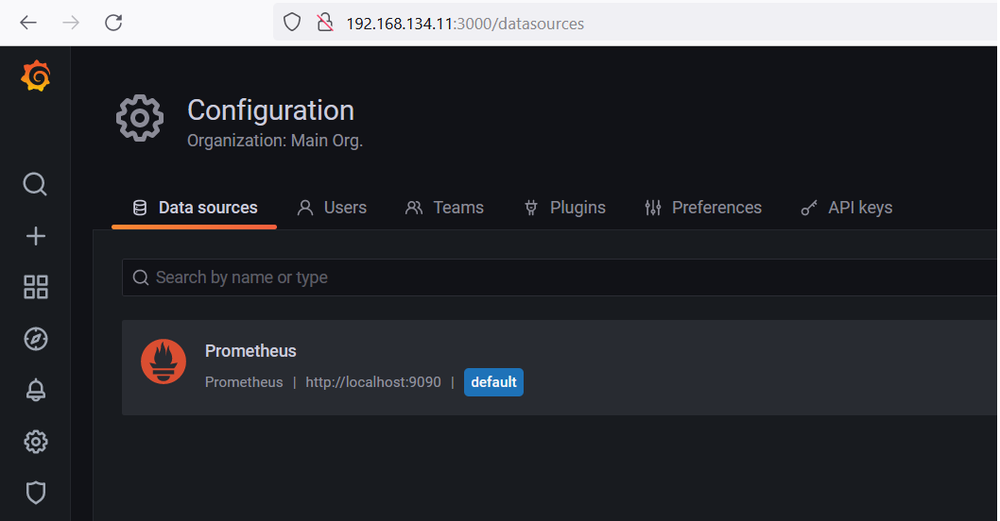
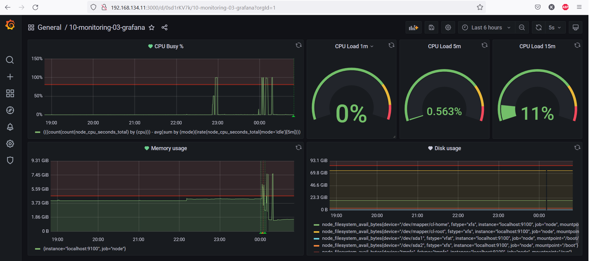
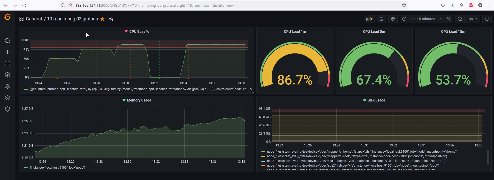
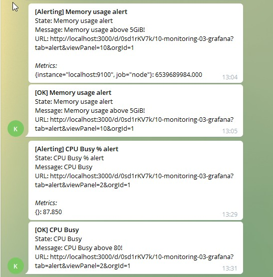

# Домашнее задание к занятию "10.03. Grafana"

## Задание 1

Развернул стек grafana prometheus-server node-exporter alertmanager на тестовой машине без применения docker образов:

```
kosmos@centos8:/tmp/netdata$ /usr/local/bin/prometheus --version
prometheus, version 2.29.1 (branch: HEAD, revision: dcb07e8eac34b5ea37cd229545000b857f1c1637)
  build user:       root@364730518a4e
  build date:       20210811-14:48:27
  go version:       go1.16.7
  platform:         linux/amd64

kosmos@centos8:/tmp/netdata$ /usr/local/bin/node_exporter --version
node_exporter, version 1.2.2 (branch: HEAD, revision: 26645363b486e12be40af7ce4fc91e731a33104e)
  build user:       root@b9cb4aa2eb17
  build date:       20210806-13:44:18
  go version:       go1.16.7
  platform:         linux/amd64

kosmos@centos8:~$ /usr/local/bin/alertmanager --version
alertmanager, version 0.23.0 (branch: HEAD, revision: 61046b17771a57cfd4c4a51be370ab930a4d7d54)
  build user:       root@e21a959be8d2
  build date:       20210825-10:48:55
  go version:       go1.16.7
  platform:         linux/amd64

kosmos@centos8:~$ /usr/sbin/grafana-server -v
Version 8.1.2 (commit: 103f8fa094, branch: HEAD)
```
​

## Задание 2

- Утилизация CPU для nodeexporter (в процентах, 100-idle)
```
(((count(count(node_cpu_seconds_total) by (cpu))) - avg(sum by (mode)(irate(node_cpu_seconds_total{mode='idle'}[5m])))) * 100) / count(count(node_cpu_seconds_total) by (cpu))
```

- CPULA 1/5/15
```
avg(node_load1) / count(count(node_cpu_seconds_total) by (cpu)) * 100
avg(node_load5) / count(count(node_cpu_seconds_total) by (cpu)) * 100
avg(node_load15) / count(count(node_cpu_seconds_total) by (cpu)) * 100
```
- Количество свободной оперативной памяти
```
node_memory_MemTotal_bytes-node_memory_MemAvailable_bytes
```

- Количество места на файловой системе
```
node_filesystem_avail_bytes
```

​

## Задание 3

Скриншот с превышением загрузки процессора выше 80% (сработал alert):

​

Пример оповещения в Telegram:

​

## Задание 4

[Ссылка на JSON модель](JSON_MODEL.json)