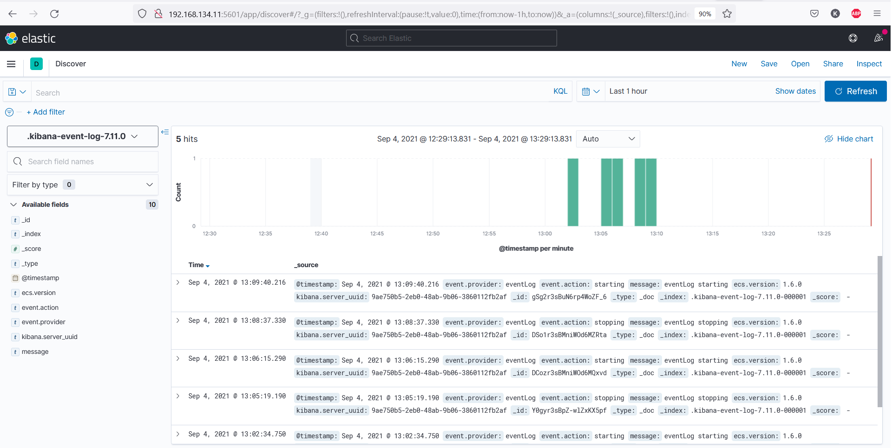
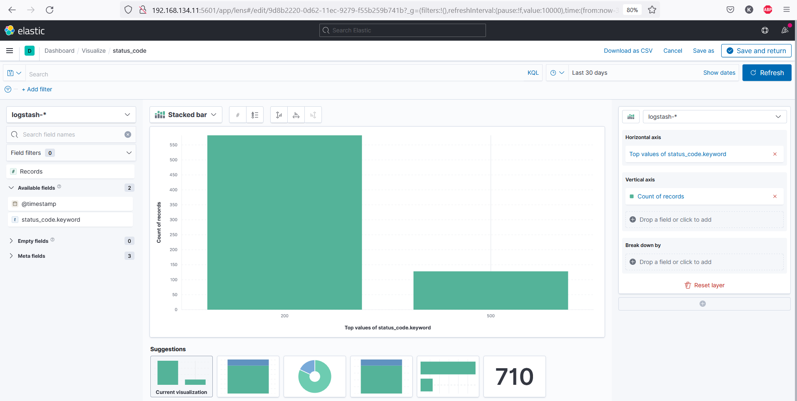
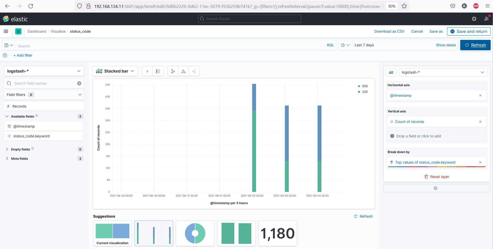

# Домашнее задание к занятию "10.04. ELK"
## Задание 1

Контейнеры запустил при помощи директории help

```
kosmos@centos8: docker ps
kosmos@centos8:/git/mnt-netology/10-monitoring-04-elk/help/configs$ docker ps
CONTAINER ID   IMAGE                                                  COMMAND                  CREATED          STATUS          PORTS                                                           NAMES
025ada27b897   docker.elastic.co/beats/filebeat:7.2.0                 "/usr/local/bin/dock…"   38 minutes ago   Up 9 minutes                                                                    filebeat
283ec3e64bce   docker.elastic.co/kibana/kibana:7.11.0                 "/bin/tini -- /usr/l…"   38 minutes ago   Up 9 minutes    0.0.0.0:5601->5601/tcp, :::5601->5601/tcp                       kibana
2eba5d4a9f4c   docker.elastic.co/logstash/logstash:6.3.2              "/usr/local/bin/dock…"   38 minutes ago   Up 9 minutes    5044/tcp, 9600/tcp, 0.0.0.0:5046->5046/tcp, :::5046->5046/tcp   logstash
ee0b4c70e28a   docker.elastic.co/elasticsearch/elasticsearch:7.11.0   "/bin/tini -- /usr/l…"   38 minutes ago   Up 10 minutes   0.0.0.0:9200->9200/tcp, :::9200->9200/tcp, 9300/tcp             es-hot
f4668e31ebcd   docker.elastic.co/elasticsearch/elasticsearch:7.11.0   "/bin/tini -- /usr/l…"   38 minutes ago   Up 10 minutes   9200/tcp, 9300/tcp                                              es-warm
8b418ee8f40a   python:3.9-alpine                                      "python3 /opt/run.py"    38 minutes ago   Up 10 minutes                                                                   some_app
```

​

## Задание 2

Индекс logstash-* в elasticsearch не удалось наполнить логами из stdout контейнера, наполнил срикптом из лекции:

```
#!/bin/sh

for (( i = 0; i <= 112; i++)); do
  curl -H "Content-Type: application/json" -XPOST "http://localhost:9200/logstash-01.09.2021/_doc" -d "{ \"status_code\" : \"200\", \"@timestamp\" : \"2021-09-01T17:32:00.457Z\"}"
done

for (( i = 0; i <= 356; i++)); do
  curl -H "Content-Type: application/json" -XPOST "http://localhost:9200/logstash-01.09.2021/_doc" -d "{ \"status_code\" : \"500\", \"@timestamp\" : \"2021-09-01T17:32:03.546Z\"}"
done
```

​

​
