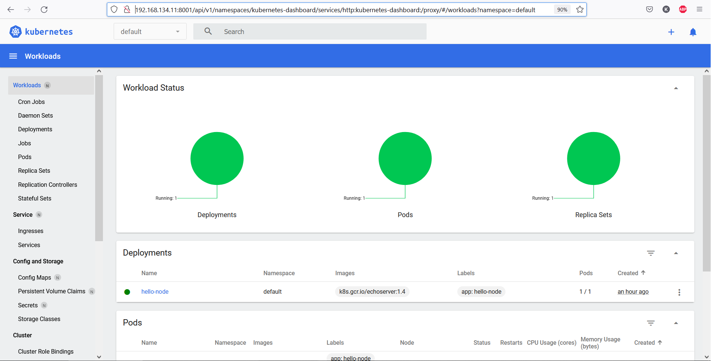
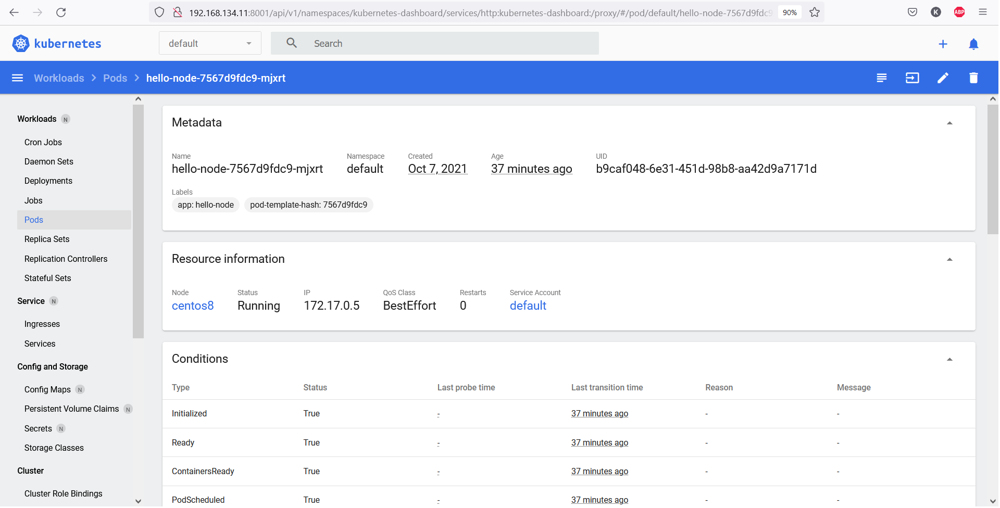

https://github.com/netology-code/devkub-homeworks/blob/main/12-kubernetes-01-intro.md

# Домашнее задание к занятию "12.1 Компоненты Kubernetes"

# Задача 1: Установить Minikube

Установка minikube на виртуальной машине Centos8 запущенной под управлением Hyper-V:

```
kosmos@centos8:/tmp$ curl -Lo minikube https://storage.googleapis.com/minikube/releases/latest/minikube-linux-amd64 \
>   && chmod +x minikube
kosmos@centos8:/tmp$ sudo mv minikube /usr/local/bin/
```

Открыл необходимые порты:

```
root@centos8:/tmp$ sudo firewall-cmd --permanent --add-port=10248/tcp
success
root@centos8:/tmp$ sudo firewall-cmd --permanent --add-port=10250/tcp
success
root@centos8:/tmp$ sudo firewall-cmd --permanent --add-port=8443/tcp
success
```

Отключил swap:

```
root@centos8:/tmp$ swapoff -v /dev/dm-1
swapoff /dev/dm-1

kosmos@centos8:/tmp$ sudo systemctl restart docker
```

Стартунул кластер:

	root@centos8:/tmp$ minikube start --vm-driver=none


Проверил статус:

```
root@centos8:/home/kosmos$ minikube status
minikube
type: Control Plane
host: Running
kubelet: Running
apiserver: Running
kubeconfig: Configured
```

```
root@centos8:/home/kosmos$ kubectl get pods --namespace=kube-system
NAME                              READY   STATUS    RESTARTS   AGE
coredns-78fcd69978-phgb6          1/1     Running   0          2m11s
etcd-centos8                      1/1     Running   1          2m23s
kube-apiserver-centos8            1/1     Running   1          2m26s
kube-controller-manager-centos8   1/1     Running   1          2m23s
kube-proxy-ndlhq                  1/1     Running   0          2m11s
kube-scheduler-centos8            1/1     Running   1          2m23s
storage-provisioner               1/1     Running   0          2m21s
```


## Задача 2: Запуск Hello World

Проброс портов без пакета socat не работал:

```
root@centos8:/home/kosmos$ dnf -y install socat
root@centos8:/home/kosmos$ kubectl port-forward --address 0.0.0.0 hello-node-7567d9fdc9-g8lws 4000:8080
```

Зааттачил pod, посмотрел stoud:

```
root@centos8:/home/kosmos$ kubectl attach hello-node-7567d9fdc9-mjxrt -i
If you don't see a command prompt, try pressing enter.

127.0.0.1 - - [06/Oct/2021:18:15:38 +0000] "GET / HTTP/1.1" 200 1242 "-" "Mozilla/5.0 (Windows NT 10.0; Win64; x64; rv:93.0) Gecko/20100101 Firefox/93.0"
127.0.0.1 - - [06/Oct/2021:18:15:43 +0000] "GET / HTTP/1.1" 200 821 "-" "Mozilla/5.0 (Windows NT 10.0; Win64; x64) AppleWebKit/537.36 (KHTML, like Gecko) Chrome/94.0.4606.71 Safari/537.36 Edg/94.0.992.38"
127.0.0.1 - - [06/Oct/2021:18:15:43 +0000] "GET /favicon.ico HTTP/1.1" 200 802 "http://192.168.134.11:4000/" "Mozilla/5.0 (Windows NT 10.0; Win64; x64) AppleWebKit/537.36 (KHTML, like Gecko) Chrome/94.0.4606.71 Safari/537.36 Edg/94.0.992.38"
127.0.0.1 - - [06/Oct/2021:18:15:46 +0000] "GET / HTTP/1.1" 200 1242 "-" "Mozilla/5.0 (Windows NT 10.0; Win64; x64; rv:93.0) Gecko/20100101 Firefox/93.0"
```
Сделал запрос из терминала:

```
kosmos@centos8:~$ curl http://192.168.134.11:4000/
CLIENT VALUES:
client_address=127.0.0.1
command=GET
real path=/
query=nil
request_version=1.1
request_uri=http://192.168.134.11:8080/

SERVER VALUES:
server_version=nginx: 1.10.0 - lua: 10001

HEADERS RECEIVED:
accept=*/*
host=192.168.134.11:4000
user-agent=curl/7.61.1
BODY:
-no body in request-
```


## Задача 3: Установить kubectl

Установка kubectl:
```
kosmos@centos8:/tmp$ curl -LO https://storage.googleapis.com/kubernetes-release/release/`curl -s https://storage.googleapis.com/kubernetes-release/release/stable.txt`/bin/linux/amd64/kubectl
kosmos@centos8:/tmp$ chmod +x ./kubectl
kosmos@centos8:/tmp$ sudo mv ./kubectl /usr/local/bin/kubectl
kosmos@centos8:/tmp$ kubectl version --client
Client Version: version.Info{Major:"1", Minor:"22", GitVersion:"v1.22.2", GitCommit:"8b5a19147530eaac9476b0ab82980b4088bbc1b2", GitTreeState:"clean", BuildDate:"2021-09-15T21:38:50Z", GoVersion:"go1.16.8", Compiler:"gc", Platform:"linux/amd64"}
```

Запуск dashboard и доступ через proxy:

```
root@centos8:~$ minikube dashboard
root@centos8:~$ kubectl proxy --address='0.0.0.0' --disable-filter=true 
```

Открылся доступ по ссыке:

http://MY_LAN_IP:8001/api/v1/namespaces/kubernetes-dashboard/services/http:kubernetes-dashboard:/proxy/#/workloads?namespace=default

​

​
