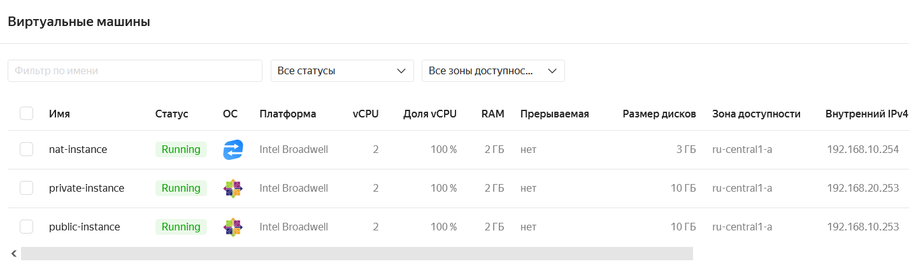
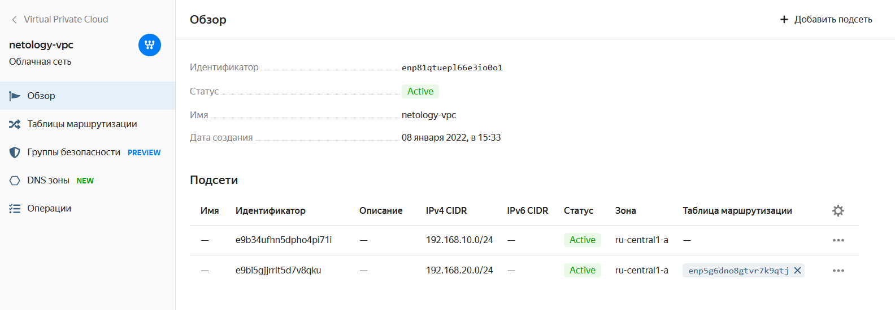
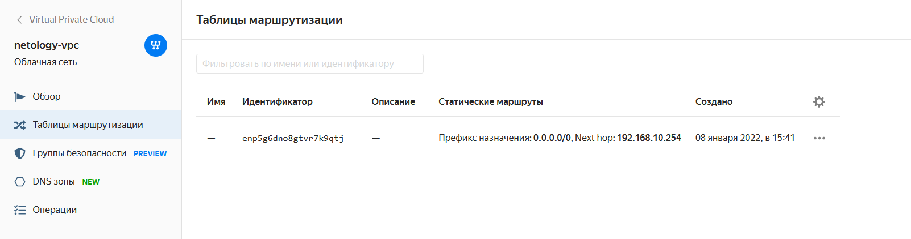

# Домашнее задание к занятию "15.1. Организация сети"

## Задание 1. Яндекс.Облако

Копия основного файла конфигурации (токены скрыты): [main.tf](main.tf.pub)

Пользователей создавал из файла (ключ скрыт): [user-kosmos-vm.txt](user-kosmos-vm.txt.pub)

Выяснил почему именно этот id image предложен для nat-instance:

```
$ yc compute image list --folder-id standard-images | grep 'nat-instance'
| fd80mrhj8fl2oe87o4e1 | nat-instance-ubuntu-1559218207                                 | nat-instance-ubuntu                    | f2ec86u5podbrqc04jij           | READY  |
| fd85tqltvlg3mtufp0il | nat-instance-ubuntu-1580391236                                 | nat-instance-ubuntu                    | f2ehjobojm7pk6st3mn8           | READY  |
| fd89mpdm5r07vhukul89 | nat-instance-ubuntu-1569860822                                 | nat-instance-ubuntu                    | f2e5f27j0m6uuor1m3ug           | READY  |
| fd8drj7lsj7btotd7et5 | nat-instance-ubuntu-1612818947                                 | nat-instance-ubuntu                    | f2eemt3jkf963ul13et5           | READY  |
| fd8o3spn0omg6o3ohkhi | nat-instance-ubuntu-1574436966                                 | nat-instance-ubuntu                    | f2eo6g3l1a679h1jh9jn           | READY  |
```

За основу виртуалок выбрал образ centos7:

```
$ yc compute image list --folder-id standard-images | grep centos-7
| fd80le4b8gt2u33lvubr | centos-7-v20211220                                             | centos-7                               | f2eaujc3c3g545cncg0v           | READY  |
```

## Примеры выполнения ping и ip a из моих виртуалок:

### centos7 в public сети (подключился через внешний ip)

```
$ ssh kosmos@wan-ip

[kosmos@fhm32n2muns78tq1pjmi .ssh]$ ip a
1: lo: <LOOPBACK,UP,LOWER_UP> mtu 65536 qdisc noqueue state UNKNOWN group default qlen 1000
    link/loopback 00:00:00:00:00:00 brd 00:00:00:00:00:00
    inet 127.0.0.1/8 scope host lo
       valid_lft forever preferred_lft forever
    inet6 ::1/128 scope host
       valid_lft forever preferred_lft forever
2: eth0: <BROADCAST,MULTICAST,UP,LOWER_UP> mtu 1500 qdisc pfifo_fast state UP group default qlen 100000
    link/ether d0:0d:31:5c:56:f5 brd ff:ff:ff:ff:ff:ff
    inet 192.168.10.253/24 brd 192.168.10.255 scope global noprefixroute eth0
       valid_lft forever preferred_lft forever
    inet6 fe80::d20d:31ff:fe5c:56f5/64 scope link
       valid_lft forever preferred_lft forever

[kosmos@fhm32n2muns78tq1pjmi ~]$ ping ya.ru
PING ya.ru (87.250.250.242) 56(84) bytes of data.
64 bytes from ya.ru (87.250.250.242): icmp_seq=1 ttl=58 time=0.763 ms
64 bytes from ya.ru (87.250.250.242): icmp_seq=2 ttl=58 time=0.423 ms
^C
--- ya.ru ping statistics ---
2 packets transmitted, 2 received, 0% packet loss, time 1001ms
rtt min/avg/max/mdev = 0.423/0.593/0.763/0.170 ms
```

### centos7 в private сети

```
ssh kosmos@192.168.20.253

[kosmos@fhm0gj0or5hsgcbf92pb ~]$ ip a
1: lo: <LOOPBACK,UP,LOWER_UP> mtu 65536 qdisc noqueue state UNKNOWN group default qlen 1000
    link/loopback 00:00:00:00:00:00 brd 00:00:00:00:00:00
    inet 127.0.0.1/8 scope host lo
       valid_lft forever preferred_lft forever
    inet6 ::1/128 scope host
       valid_lft forever preferred_lft forever
2: eth0: <BROADCAST,MULTICAST,UP,LOWER_UP> mtu 1500 qdisc pfifo_fast state UP group default qlen 100000
    link/ether d0:0d:84:c1:8d:96 brd ff:ff:ff:ff:ff:ff
    inet 192.168.20.253/24 brd 192.168.20.255 scope global noprefixroute eth0
       valid_lft forever preferred_lft forever
    inet6 fe80::d20d:84ff:fec1:8d96/64 scope link
       valid_lft forever preferred_lft forever

[kosmos@fhm0gj0or5hsgcbf92pb ~]$ ping ya.ru
PING ya.ru (87.250.250.242) 56(84) bytes of data.
64 bytes from ya.ru (87.250.250.242): icmp_seq=1 ttl=56 time=2.03 ms
64 bytes from ya.ru (87.250.250.242): icmp_seq=2 ttl=56 time=0.852 ms
^C
--- ya.ru ping statistics ---
2 packets transmitted, 2 received, 0% packet loss, time 1002ms
rtt min/avg/max/mdev = 0.852/1.441/2.030/0.589 ms
```

### nat-instance:

```
ssh kosmos@192.168.10.254

kosmos@fhm06nh5pej7no01550r:~$ ip a
1: lo: <LOOPBACK,UP,LOWER_UP> mtu 65536 qdisc noqueue state UNKNOWN group default qlen 1000
    link/loopback 00:00:00:00:00:00 brd 00:00:00:00:00:00
    inet 127.0.0.1/8 scope host lo
       valid_lft forever preferred_lft forever
    inet6 ::1/128 scope host
       valid_lft forever preferred_lft forever
2: eth0: <BROADCAST,MULTICAST,UP,LOWER_UP> mtu 1500 qdisc mq state UP group default qlen 1000
    link/ether d0:0d:35:e2:5c:ba brd ff:ff:ff:ff:ff:ff
    inet 192.168.10.254/24 brd 192.168.10.255 scope global eth0
       valid_lft forever preferred_lft forever
    inet6 fe80::d20d:35ff:fee2:5cba/64 scope link
       valid_lft forever preferred_lft forever

kosmos@fhm06nh5pej7no01550r:~$ ping ya.ru
PING ya.ru (87.250.250.242) 56(84) bytes of data.
64 bytes from ya.ru (87.250.250.242): icmp_seq=1 ttl=58 time=0.599 ms
64 bytes from ya.ru (87.250.250.242): icmp_seq=2 ttl=58 time=0.330 ms
^C
--- ya.ru ping statistics ---
2 packets transmitted, 2 received, 0% packet loss, time 1001ms
rtt min/avg/max/mdev = 0.330/0.464/0.599/0.136 ms
```

## Скриншоты машин, сети, подсетей и таблицы маршрутизации:

​

​

​